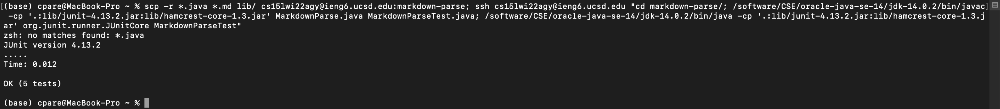

# Lab Report 3 Week #6
 > In this weeks Lab Report, I will be explaing the steps to remotely copying the `markdownparse` repository to the ieng6 server at the UCSD CSE basement. I will be walking through the steps of choice #3 from the week 5 lab. In order to do this we need to run certain commands such as `scp -r` to successfully copy the repository.

## 1) Copying Markdown Parse to your personal ieng6 account

&nbsp;

In order to copy the markdownparse repository on your computer to a remote server such as ineg6 at UCSD, we first need to run the commmand `$ scp -r . cs15lwi22abc@ieng6.ucsd.edu:~/markdown-parse` where `abc` is your personal username to log into the ieng6 server which you could look up here 
[Account Lookup](https://sdacs.ucsd.edu/~icc/index.php) . In the image above we see each file and directory in the repository being successfully uploaded to your ieng6 account.

&nbsp;

## 2) Running JUnit Tests on ineg6

&nbsp;

In order to run the Junit Tests on ieng6 we first need to make sure that we have all of the neccessary files to run the Tests. We need to make sure we have the `MarkdownParse.java`, `MarkdownParseTest.java` as well as the directory `lib` where we have all of the JUnit files in order to be able to run the tests. After checking we have all of these files and directories using the `ls` command in the termninal, we can now run the commands to run our JUnit Tests on ieng6. In the image above we see that all of the tests ran successfully and there was no errors on ieng6 with these JUnit tests.

&nbsp;

## 3) Using `ssh` , `scp`, and `;` in one line to log into ieng6, copy files, and run them

In order to be able to `ssh`, `scp` , and `;` in one line to log into ieng6 we need run the command, `scp -r *.java *.md lib/ cs15lwi22agy@ieng6.ucsd.edu:markdown-parse; ssh cs15lwi22agy@ieng6.ucsd.edu "cd markdown-parse/; /software/CSE/oracle-java-se-14/jdk-14.0.2/bin/javac -cp '.:lib/junit-4.13.2.jar:lib/hamcrest-core-1.3.jar' MarkdownParse.java MarkdownParseTest.java; /software/CSE/oracle-java-se-14/jdk-14.0.2/bin/java -cp '.:lib/junit-4.13.2.jar:lib/hamcrest-core-1.3.jar' org.junit.runner.JUnitCore MarkdownParseTest"`. This is a long command because if we try running with a differnt command we will into some errors. I initially ran this command with a different command and I was receiving a version error and that was because my Java version on my computer was different to the java version on ieng6.