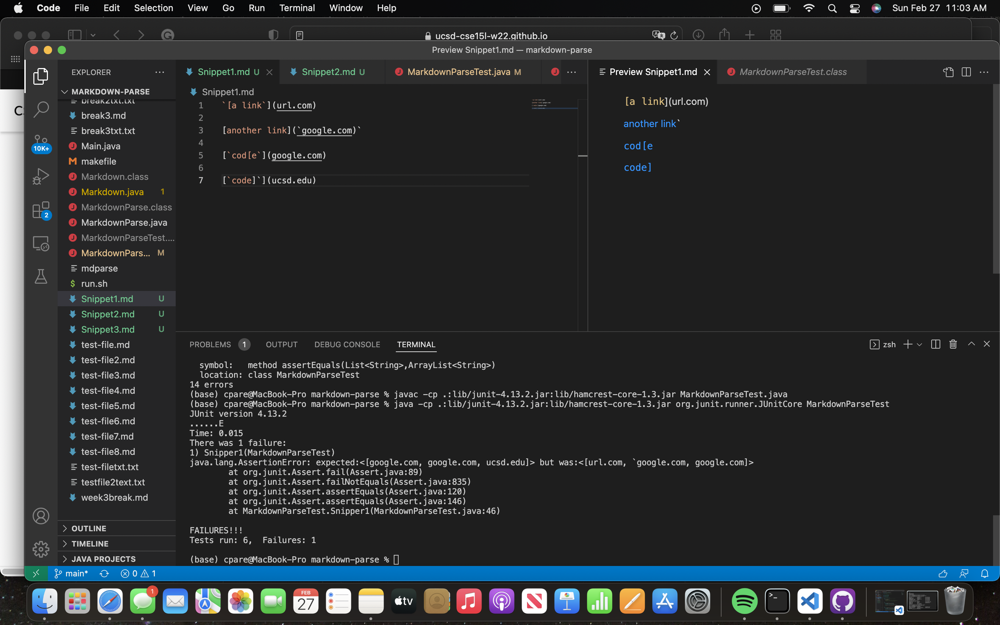
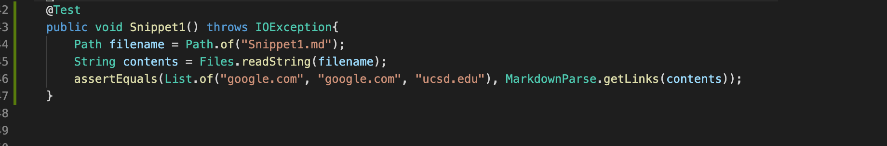
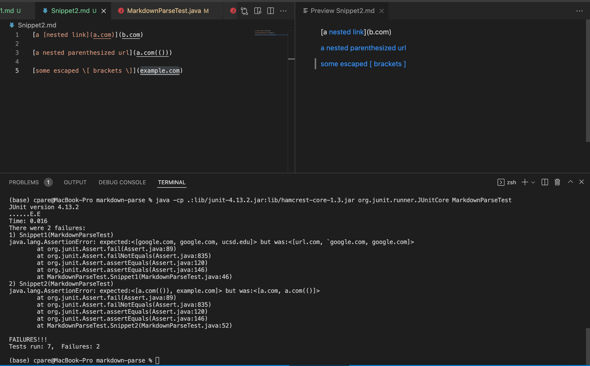
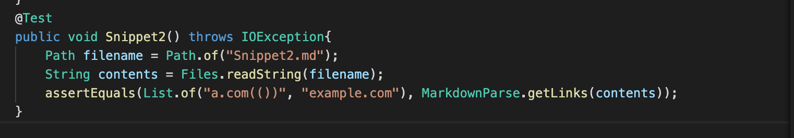
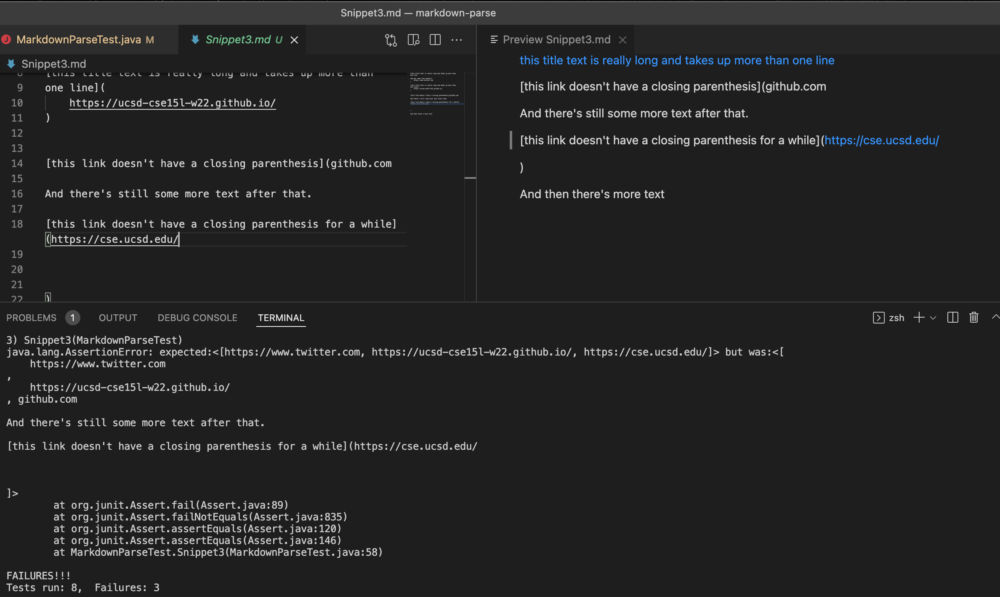
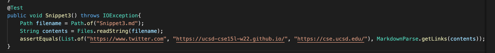

# CSE 15L Lab Report #4
> In this weeks lab report, we are continuing to work with both the MarkdownParse code and the MarkdownParseTest code. This week, we are adding three more markdown test files, Snippet1, Snippet2, and Snippet3. These files will test not only my code but the code that I reviewed for week7 of this course which was the code from another group. The three new markdown files will be a good test for both programs because it tests how the programs behave to having backticks `` in the markdown file. Here, I will be implementing three new tests for each program and displaying the output for each test after running the program. First, I will start with my program. Here is the link to my repository [GitHub Repo](https://github.com/cpareja3025/cse15l-lab-reports) where I include all of the code needed to run my tests. Second, I will run the program from week7 that I reviewed, here is the link [Week7 Group GitHub Repo](https://github.com/nakulnandhakumar/markdown-parse)

# Snippet1

&nbsp;

## My Program

First, we're going to start with my program implementation. After looking at the VScode preview of 
Snippet1 with my program. I added a test 
method to MarkdownParseTest.java called 
`Snippet1`. I believed that running the program with Snippet1 would produce a list of `[google.com, google.com, ucsd.edu]`. I have attached an image 
below as to what I expected from the 
VScode markdown preview. I'm also 
attaching an image  of my code for 
`MarkdownParseTest.java`. My test did not pass and I'm adding an image of my `MarkdownParseTest.java`.

&nbsp;

## Week7 Program
## Bug Fixes
Although my program for Snippet 1 did not pass the tests that I implemented in `MarkdownParseTest.java`. I believe we can fix this part of the code in less than 10 lines. We could create a new variable named `backticks` and implement an `if` statement where the program is told to ignore the backticks if it comes across backticks either between the open and closed brackets and to continue searching for the closed parantheses if it comes across backticks.

&nbsp;

# Snippet2

&nbsp;

## My Program

Next, we're going going to run the Snippet2 markdown file with `MarkdownParseTest.java`. After looking at the VScode 
preview of 
Snippet2 with my program. I added a test 
method to MarkdownParseTest.java called 
`Snippet2`. I believed that running the 
program with Snippet2 would produce a list of 
`[a.com(()), example.com]`. I have 
attached an image 
below as to what I expected from the 
VScode markdown preview. I'm also 
attaching an image  of my code for 
`MarkdownParseTest.java`. My test did not pass and I'm adding an image of my `MarkdownParseTest.java` code.

&nbsp;

## Week7 Program

## Bug Fixes
My `MarkdownParse` file did not pass the `MarkdownParseTest.java` tests that I implemented. I don't believe that we can fix the problems in this Snippet2 file in less than 10 lines of code. We will need to add a an `if` statement in our `while` loop where we will use `&&` statements for different types of nested links. For example, we will use an if statment to tell the program to ignore links or open and closed parentheses inside the brackets `[]` then we will use more if statements for different cases in brackets and escpated brackets.

&nbsp;

# Snippet3

&nbsp;

## My Program
Next, we're going going to run the Snippet3 
markdown file with `MarkdownParseTest.java`. 
After looking at the VScode 
preview of 
Snippet3. I added a test 
method to MarkdownParseTest.java called 
`Snippet3`. I believed that running the 
program with Snippet2 would produce a list of 
`[google.com, google.com, ucsd.edu]`. I have 
attached an image 
below as to what I expected from the 
VScode markdown preview. I'm also 
attaching an image  of my code for 
`MarkdownParseTest.java`. My test did not 
pass and I'm adding an image of my 
`MarkdownParseTest.java` code.

&nbsp;

## Week7 Program
## Bug Fixes
My program for Snippet3 did not pass. In order to have all of these cases work in `MarkdownParse.java` we will need to fix the code with more than 10 line of code. I believe that this is the cases because these cases in snippet3 are unique and require mutiple if statements in order for our program to successfully pass all tests. 

&nbsp;
