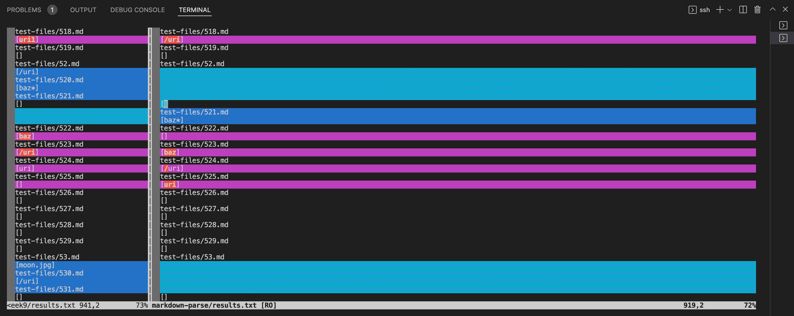

# CSE 15L Lab Report #5
> In this weeks lab report, we're gonna be working with the commonmark-spec tests from the lab in week9. Here, I'm going to be analyzing two tests from the commonmark-spec where our markdown parser code and the week9 markdown parser code achieved different outputs when running these tests side by side. I'm going to be working on two tests that each contain their respective bugs and I will be explaining how I first found these tests, and explaining the implementation of the tests with each respective markdown parser code.

## Test 524.md
In test 524.md we have a markdown file that contains the contents
```
[foo`](/uri)`
```
After comparing both the implementation between my markdown-parse code and the mardown-parse code from week9, we see that the code from markdown-parseWeek9 is actually outputting the incorrect link in a list. The correct output is `[/uri]` and that is exactly what's on the right side of the comparison table
The comparison is down below.

The table above is strucutred in the way that my markdown-parse output is on the RIGHT and the markdown-parse from Week9 is on the LEFT. In order to have my code produce the same correct output I believe we need to add an extra if statement that will take into account backticks and backslashes . I suggest that this part of the code should be fixed. I believe that we should add an additional if statement where `nextCloseBracket + 1` equals a backslash then continue instead of not having it as part of the output.


## Test 576.md
In test file 576.md we have a markdown file that contains the contents
```
![foo *bar*][foobar]

[FOOBAR]: train.jpg "train & tracks"
```
After comparing both the implementation between my markdown-parse code and the markdown-parse code from Week9, we see that the code from markdown-parseWeek9 is incorrect and my markdown-parse has the correct output which is an empty list `[]`. In order to declare a link in markdown, we need to have an open and closed bracked followed by an open and closed parentheses. In the file contents of 576.md, we see that there are no open or closed parentheses. Therefore, this markdown file containts no links. The comparison of the outputs is below with my code being on the right and the week9 markdown-parse output being on the left. 
 
In order to have the week9 markdown-parse code produce a correct output of an empty list `[]`, then we must edit the section of code starting with this if statement. 
```
if(openParenCount == 0)
```
I believe that we need to add a break statement because if the openparent count is 0 then there is no link in this markdown file.


## Summary

In order to produce the tables above that show us the output of both implementations with the filename before the output, I used the `vimdiff` command while logged into my ieng6 account. First, I created a bash file with the following contents

```
for file in test-files/*.md;
do
  echo $file
  java MarkdownParse $file
done
```
I used a bash loop and `echo` to print the names of the files.  Then I used the command `vimdiff markdown-parse-Labweek9/results.txt markdown-parse/results.txt` to get compare the outputs of both implementations.
